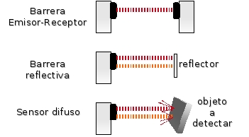

# Mencione los tipos de sensores fotovoltaicos y defina 2.  

SENSORES FOTOELECTRICOS

Un sensor fotoeléctrico es un dispositivo electrónico que responde al cambio en la intensidad de la luz. Estos sensores requieren de un componente emisor que genera la luz, y un componente receptor que “ve” la luz generada por el emisor. Todos los diferentes modos de sensado se basan en este principio de funcionamiento. Están diseñados especialmente para la detección, clasificación y posicionado de objetos; la detección de formas, colores y diferencias de superficie, incluso bajo condiciones ambientales extremas.

Los sensores de luz se usan para detectar el nivel de luz y producir una señal de salida representativa respecto a la cantidad de luz detectada. Un sensor de luz incluye un transductor fotoeléctrico para convertir la luz a una señal eléctrica y puede incluir electrónica para condicionamiento de la señal, compensación y formateo de la señal de salida.

### **Barrera Emisor-Recepto:**  
El sensor viene en 2 piezas, el emisor y el receptor, cuando el objeto atraviesa el haz de luz es cuando se activa el sensor.

### **Barrera Reflectiva:**  
En el cuerpo del sensor se encuentra el emisor y el receptor, en el otro extremo va una cinta reflectiva para regresar el haz de luz. Existen cintas reflectivas con filtro, es decir que solo reflejan la luz que emite el sensor y discriminan cualquier otra señal luminosa.

### **Sensor Difuso:**  
En el cuerpo del sensor se encuentra el emisor y receptor, estos están colocados con cierto ángulo, de tal manera, que el haz triangule sobre el objeto a censar y refleje la luz. Es el de Menor Rango.

**Barrera de luz**

    Las barreras tipo emisor-receptor están compuestas de dos partes, un componente que emite el haz de luz, y otro componente que lo recibe. Se establece un área de detección donde el objeto a detectar es reconocido cuando el mismo interrumpe el haz de luz. Debido a que el modo de operación de esta clase de sensores se basa en la interrupción del haz de luz, la detección no se ve afectada por el color, la textura o el brillo del objeto a detectar. Estos sensores operan de una manera precisa cuando el emisor y el receptor se encuentran alineados. Esto se debe a que la luz emitida siempre tiende a alejarse del centro de la trayectoria.

    Ventajas e Inconvenientes

    La luz solo tiene que atravesar el espacio de trabajo una vez, por lo que se favorecen grandes distancias de funcionamiento, hasta 60 metros. Son apropiadas para condiciones ambientales poco favorables, como suciedad, humedad, o utilización a la intemperie, así como independientemente del color del objeto realiza una detección precisa del objeto. La instalación se ve dificultada por tener que colocar dos aparatos separados y con los ejes ópticos alineados de manera precisa y delicada, ya que el detector emite en infrarrojos. Además de la imposibilidad de que sean transparentes..

    Precauciones de montaje

    A la hora del montaje hay que tener en cuenta las superficies reflectantes cercanas a los dispositivos, provocando un mal funcionamiento de la fotocélula. También hay que tener en cuenta las posibles interferencias mutuas por la cercanía de varios de estos dispositivos, además de controlar los ambientes sucios, ya que la suciedad afecta negativamente en la lente emisora.

**Reflexión sobre espejo**

    La luz infrarroja viaja en línea recta, en el momento en que un objeto se interpone el haz de luz rebota contra este y cambia de dirección permitiendo que la luz sea enviada al receptor y el elemento sea censado, un objeto de color negro no es detectado ya que este color absorbe la luz y el sensor no experimenta cambios.

    Ventajas e Inconvenientes

    En estas fotocélulas el haz de luz recorre dos veces la distancia de detección, con lo cual las distancias de trabajo que se consiguen son medias (de unos 15 metros). El espejo es fácil de instalar, y no se necesita cableado hasta el mismo, por lo que solo hay que cablear un detector. Además de ser válidos para detección de objetos opacos, también cubren eficientemente aplicaciones con detección de objetos con cierto grado de transparencia. El problema más llamativo es que el objeto a detectar tiene que ser mayor que el espejo y, a ser posible, no reflectante, además de que la alineación tiene que ser precisa.

    Precauciones de montaje

    Un objeto con superficie reflectante puede provocar errores de detección. esto se puede evitar haciendo que la reflexión del objeto a detectar no tenga la misma inclinación que el haz del detector.

**Reflexión difusa**

    En las fotocélulas de reflexión difusa sobre el objeto el emisor lanza un haz de luz; los rayos del haz se pierden en el espacio si no hay objeto, pero cuando hay presencia de objeto, la superficie de éste produce una reflexión difusa de la luz, parte de la cual incide sobre el receptor y se cambia así la señal de salida de la fotocélula.

**Reflexión definida**

    La reflexión en la superficie del objeto a detectar por las fotocélulas de reflexión definida normalmente es de carácter difuso, como en los sensores de reflexión difusa, o sea que los rayos reflejados salen sin una trayectoria determinada. Esto es muy importante, para no caer en la falsa idea de que la diferencia respecto a los sensores de reflexión difusa está en el tipo de reflexión; lo está en el tipo de óptica empleada. En las fotocélulas de reflexión definida la fuente de luz está a una distancia mayor que la distancia focal, por lo que el haz converge a un punto del eje óptico

    Ventajes e Inconvenientes

    Las fotocélulas de reflexión sobre objeto se componen únicamente de un emisor y un receptor montados bajo una misma carcasa, por lo que el montaje es sencillo y rápido. En estas fotocélulas el haz de luz recorre dos veces la distancia de detección y además el objeto puede ser de reflectividad baja, por lo que sólo se consiguen distancias de detección pequeñas (por lo general menos de un metro 
