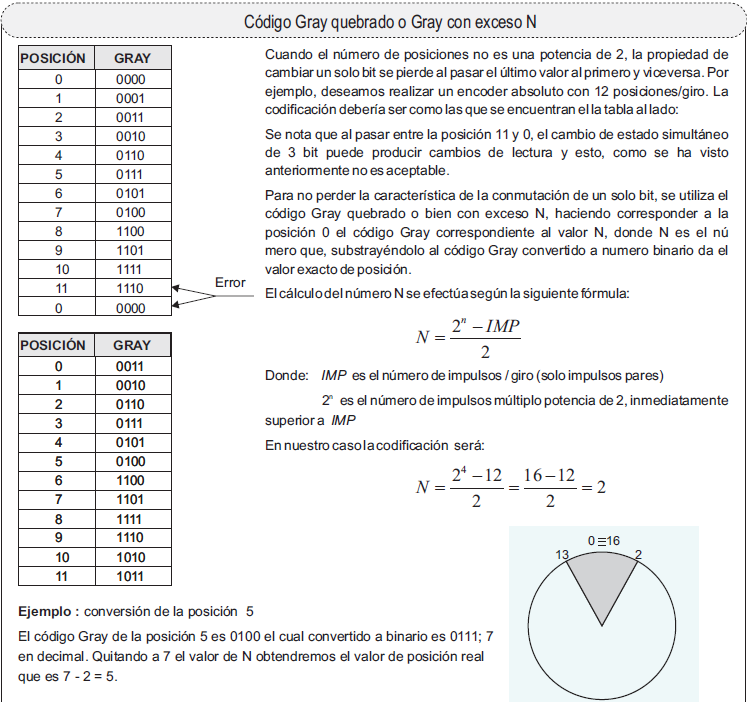

El código Gray o código binario reflejado, nombrado así en honor del investigador Frank Gray, es un sistema de numeración binario en el que dos números consecutivos difieren solamente en uno de sus dígitos.

De un valor en código Gray al siguiente solo hay un cambio de un bit, como puede apreciarse en la siguiente tabla. Se han incluido en ella las expresiones BCD, que ya son conocidas.

Observa también que los bits son simétricos respecto a la línea en la que se cambia de color.

  

  
| DECIMAL	|BCD	|GRAY 2 BITS	|GRAY 3 BITS	|GRAY 4 BITS|
|:---------:|:-----:|:-------------:|:-------------:|:---------:|
| 0	| 0000	| 00	| 000	|0000|
| 1	| 0001	| 01 	| 001	|0001|
| 2	| 0010	| 11	| 011	|0011|
| 3	| 0011	| 10	| 010	|0010|
| 4	| 0100	 |      | 110	|0110|
| 5	| 0101	 |	    | 111	|0111|
| 6	| 0110	 |	    | 101	|0101|
| 7	| 0111	 |	    | 100	|0100|
| 8	| 1000	 |	 	|       |1100|
| 9	| 1001	 |	 	|       |1101|
| 10| 1010	 |	 	|       |1111|
| 11| 1011	 |	 	|       |1110|
| 12| 1100	 |	 	|       |1010|
| 13| 1101	 |	 	|       |1011|
| 14| 1110	 |	 	|       |1001|
| 15| 1111	 |	 	|       |1000|  

Se puede ver que el código Gray es también cíclico, ya que cuando llegamos al número más alto, con un solo cambio de bit se vuelve al inicio.

El código Gray fue diseñado originalmente para prevenir señales falsas o viciadas de los relés que se empleaban en las primeras computadoras, y actualmente es usado para facilitar la corrección de errores en los sistemas de comunicaciones, tales como algunos sistemas de televisión por cable y la televisión digital terrestre.

En robótica, es utilizado principalmente en sistemas de posición (encoders), ya sea angular o lineal. Sus aplicaciones principales se encuentran en la industria y en robótica. Se suelen utilizar unos discos codificados para dar la información de posición que tiene un eje en particular. Esta información se da en código GRAY.

Una aplicación adicional, no la podemos olvidar, es la que se da en los diagramas de Karnaugh, para la simplificación de funciones lógicas.  

  

